# IPL Auction Bid Platform - Next.js 15 Demo

> **A comprehensive Next.js 15 learning project** demonstrating advanced framework features, modern React patterns, and real-time capabilities through an interactive IPL auction platform.

## 📚 Course Project Overview

This project serves as a **hands-on demonstration** of Next.js 15's most powerful features. Built as a realistic IPL cricket auction platform, it showcases enterprise-level patterns, real-time data handling, and modern full-stack development practices.

### What You'll Learn

- ✅ Next.js 15 App Router architecture
- ✅ Server Components vs Client Components patterns
- ✅ Server Actions for type-safe mutations
- ✅ Real-time updates with Server-Sent Events (SSE)
- ✅ Optimistic UI updates and state management
- ✅ Edge Runtime for low-latency APIs
- ✅ React 19 features and patterns
- ✅ TypeScript strict mode best practices
- ✅ Modern UI with Tailwind CSS + Shadcn/UI

---

## 🚀 Tech Stack

| Technology | Version | Purpose |
|------------|---------|---------|
| **Next.js** | 15.0.0 | App Router, Server Components, Server Actions |
| **React** | 19.0.0 | UI library with latest features |
| **TypeScript** | 5.6.0 | Type safety in strict mode |
| **TanStack Query** | 5.59.0 | Client-side state management & caching |
| **Tailwind CSS** | 3.4.0 | Utility-first styling |
| **Shadcn/UI** | Latest | Pre-built accessible components |
| **Zod** | 3.23.8 | Runtime schema validation |
| **Sonner** | Latest | Toast notifications |

---

## 🎯 Next.js 15 Features Demonstrated

### 1. **App Router & File-Based Routing**

```
app/
├── layout.tsx           # Root layout with providers
├── page.tsx            # Homepage (Server Component)
├── dashboard/          # Dashboard route group
│   ├── page.tsx       # Server Component with streaming
│   ├── loading.tsx    # Automatic loading UI
│   └── components/    # Feature components
├── auction/
│   └── [auctionId]/   # Dynamic route with params
│       ├── page.tsx   # Server Component wrapper
│       ├── actions.ts # Server Actions
│       └── live-bids.tsx # Client Component
└── api/
    └── auction/
        └── live/
            └── route.ts # Edge Runtime SSE endpoint
```

**Learning Points:**
- File-system based routing with App Router
- Layout composition and nesting
- Dynamic route segments with `[param]`
- Route groups for organization
- API routes with Route Handlers

### 2. **Server Components (Default)**

**Files:** `app/dashboard/page.tsx`, `app/teams/page.tsx`, `app/players/page.tsx`

```tsx
// Server Component - runs only on server
export default async function DashboardPage() {
  // Direct database access (no API needed)
  const metrics = await getDashboardMetrics();
  const teams = await getAllTeams();
  
  return (
    <div>
      <Suspense fallback={<MetricsSkeleton />}>
        <MetricCards metrics={metrics} />
      </Suspense>
      {/* ... */}
    </div>
  );
}
```

**Benefits Demonstrated:**
- Zero client JavaScript for data fetching
- Direct database/API access
- Automatic code splitting
- Better SEO and initial load performance
- Reduced bundle size

### 3. **Client Components ('use client')**

**Files:** `app/auction/[auctionId]/live-bids.tsx`, `app/dashboard/components/create-auction.tsx`

```tsx
'use client';

import { useState, useEffect } from 'react';

export function LiveBidComponent({ initialAuction }: Props) {
  const [timeRemaining, setTimeRemaining] = useState(60);
  
  // Client-side interactivity
  useEffect(() => {
    // EventSource for real-time updates
    const eventSource = new EventSource(`/api/auction/live?auctionId=${auctionId}`);
    // ...
  }, []);
  
  return (/* Interactive UI */);
}
```

**When to Use Client Components:**
- Interactive UI with state (`useState`, `useEffect`)
- Event handlers (`onClick`, `onChange`)
- Browser APIs (`EventSource`, `localStorage`)
- Third-party libraries needing browser context
- Real-time updates and subscriptions

### 4. **Server Actions**

**File:** `app/auction/[auctionId]/actions.ts`

```tsx
'use server';

import { revalidatePath } from 'next/cache';

export async function placeBidAction(
  auctionId: string,
  teamId: string,
  amount: number
): Promise<ActionResponse<Auction>> {
  // Zod validation
  const validated = placeBidSchema.parse({ auctionId, teamId, amount });
  
  // Database mutation with atomic locking
  const result = await placeBid(validated.auctionId, validated.teamId, validated.amount);
  
  // Revalidate cache
  revalidatePath('/dashboard');
  revalidatePath(`/auction/${auctionId}`);
  
  return { success: true, data: result.auction };
}
```

**Key Concepts:**
- `'use server'` directive for server-only execution
- Type-safe mutations without REST APIs
- Automatic POST endpoint generation
- Built-in CSRF protection
- `revalidatePath()` for cache invalidation
- Progressive enhancement (works without JS)

### 5. **Streaming with Suspense**

**File:** `app/dashboard/page.tsx`

```tsx
export default function DashboardPage() {
  return (
    <div>
      {/* Stream different parts independently */}
      <Suspense fallback={<Skeleton />}>
        <MetricCard icon={Users} label="Total Teams" fetchData={getTeamCount} />
      </Suspense>
      
      <Suspense fallback={<Skeleton />}>
        <MetricCard icon={Trophy} label="Live Auctions" fetchData={getLiveCount} />
      </Suspense>
      
      <Suspense fallback={<ActivitySkeleton />}>
        <ActivityFeed />
      </Suspense>
    </div>
  );
}
```

**Benefits:**
- Progressive rendering - show content as it loads
- Better perceived performance
- Parallel data fetching
- Granular loading states
- No client-side loading spinners needed

### 6. **Server-Sent Events (SSE) for Real-Time**

**File:** `app/api/auction/live/route.ts`

```tsx
export const runtime = 'edge'; // Low latency

export async function GET(request: NextRequest) {
  const stream = new ReadableStream({
    start(controller) {
      const encoder = new TextEncoder();
      
      // Send updates every second
      const interval = setInterval(() => {
        const auction = getAuctionById(auctionId);
        const message = `data: ${JSON.stringify({ type: 'auction_update', auction })}\n\n`;
        controller.enqueue(encoder.encode(message));
      }, 1000);
      
      // Cleanup on disconnect
      request.signal.addEventListener('abort', () => {
        clearInterval(interval);
        controller.close();
      });
    },
  });
  
  return new Response(stream, {
    headers: {
      'Content-Type': 'text/event-stream',
      'Cache-Control': 'no-cache',
      'Connection': 'keep-alive',
    },
  });
}
```

**Why SSE over WebSockets:**
- Simpler for one-way server→client updates
- Automatic reconnection
- Works over HTTP/2
- Better for read-heavy real-time data
- Lower overhead than WebSockets

### 7. **Edge Runtime**

**File:** `app/api/auction/live/route.ts`

```tsx
export const runtime = 'edge';
```

**Advantages:**
- Deployed to edge locations globally
- <50ms cold start (vs Node.js ~500ms)
- Lower latency for API responses
- Ideal for real-time and streaming
- Cost-effective scaling

### 8. **Dynamic Route Parameters (Next.js 15 Change)**

**File:** `app/auction/[auctionId]/page.tsx`

```tsx
// Next.js 15: params is now a Promise
interface AuctionPageProps {
  params: Promise<{ auctionId: string }>;
}

export default async function AuctionPage({ params }: AuctionPageProps) {
  const { auctionId } = await params; // Must await!
  
  const auction = getAuctionById(auctionId);
  return <LiveBidComponent auctionId={auctionId} initialAuction={auction} />;
}
```

**Breaking Change in Next.js 15:**
- `params` is now async and must be awaited
- Prevents accidental synchronous access
- Better type safety

### 9. **Optimistic UI Updates**

**File:** `app/auction/[auctionId]/live-bids.tsx`

```tsx
const bidMutation = useMutation({
  mutationFn: ({ teamId, amount }) => placeBidAction(auctionId, teamId, amount),
  
  onMutate: async ({ teamId, amount }) => {
    // Cancel queries
    await queryClient.cancelQueries(['auction', auctionId]);
    
    // Snapshot previous state
    const previous = queryClient.getQueryData(['auction', auctionId]);
    
    // Optimistically update UI
    queryClient.setQueryData(['auction', auctionId], {
      ...previous,
      currentBid: amount,
      currentBidder: teamId,
    });
    
    return { previous };
  },
  
  onError: (error, variables, context) => {
    // Rollback on error
    queryClient.setQueryData(['auction', auctionId], context.previous);
  },
});
```

**Pattern Benefits:**
- Instant UI feedback
- Better UX during network delays
- Automatic rollback on errors
- Combined with Server Actions

### 10. **Type Safety with Zod**

**File:** `lib/validations.ts`

```tsx
import { z } from 'zod';

export const placeBidSchema = z.object({
  auctionId: z.string().min(1),
  teamId: z.string().min(1),
  amount: z.number().positive(),
});

export type PlaceBidInput = z.infer<typeof placeBidSchema>;
```

**Integration with Server Actions:**
- Runtime validation of inputs
- Type inference for TypeScript
- Automatic error messages
- Protection against invalid data

---

## 🏗️ Application Architecture

### Data Flow Diagram

```
┌─────────────────────────────────────────────────────────┐
│                     Browser (Client)                     │
├─────────────────────────────────────────────────────────┤
│  Client Components                                       │
│  ├─ LiveBidComponent (useState, useEffect, SSE)        │
│  ├─ CreateAuctionButton (onClick handlers)              │
│  └─ TanStack Query (client cache)                       │
└──────────────┬────────────────────┬─────────────────────┘
               │                    │
        Server Actions         SSE Connection
               │                    │
┌──────────────▼────────────────────▼─────────────────────┐
│                  Next.js Server                          │
├─────────────────────────────────────────────────────────┤
│  Server Components                                       │
│  ├─ DashboardPage (async, direct DB access)            │
│  ├─ TeamsPage (streaming with Suspense)                │
│  └─ PlayersPage (filtering, sorting)                    │
│                                                          │
│  Server Actions                                          │
│  ├─ placeBidAction (mutations, revalidation)           │
│  ├─ completeAuctionAction (business logic)              │
│  └─ Zod validation                                       │
│                                                          │
│  Route Handlers (Edge Runtime)                           │
│  └─ /api/auction/live (SSE stream)                      │
└──────────────┬──────────────────────────────────────────┘
               │
        Direct Access
               │
┌──────────────▼──────────────────────────────────────────┐
│           In-Memory Database (globalThis)                │
│  ├─ Teams (Map<string, Team>)                           │
│  ├─ Players (Map<string, Player>)                       │
│  ├─ Auctions (Map<string, Auction>)                     │
│  └─ Atomic bid locks (race condition prevention)        │
└─────────────────────────────────────────────────────────┘
```

### Component Hierarchy

```
app/layout.tsx (Root)
├─ Providers (TanStack Query)
├─ Navigation
└─ Children
    ├─ app/page.tsx (Homepage - Server Component)
    ├─ app/dashboard/page.tsx (Server Component)
    │   ├─ <Suspense> → MetricCard
    │   ├─ <Suspense> → LiveAuctionsList
    │   ├─ <Suspense> → ActivityFeed
    │   └─ CreateAuctionButton (Client)
    ├─ app/teams/page.tsx (Server Component)
    ├─ app/players/page.tsx (Server Component)
    └─ app/auction/[auctionId]/page.tsx (Server Component)
        └─ LiveBidComponent (Client)
            ├─ SSE connection
            ├─ TanStack Query
            ├─ Optimistic updates
            └─ Server Actions
```

---

## 🔄 Application Workflow

### 1. **Creating an Auction**


**Steps:**
1. User clicks "Start New Auction" button
2. Client component opens modal with player list
3. User selects a player
4. `createAuctionAction` Server Action called
5. Database creates auction with 60s timer
6. Player status → "Live"
7. Path revalidation updates dashboard
8. User redirected to live auction page

### 2. **Placing a Bid**


**Steps:**
1. User selects team and enters bid amount
2. Click "Place Bid" button
3. **Optimistic Update**: UI immediately shows the bid
4. `placeBidAction` Server Action called
5. Zod validates input data
6. Database acquires atomic lock (prevents race conditions)
7. Validates: bid > current bid, team has purse
8. Updates auction state
9. Releases lock
10. Cache revalidated for fresh data
11. Success/error response
12. If error: TanStack Query rolls back to previous state
13. Toast notification shown

### 3. **Real-Time Updates (SSE)**


**Steps:**
1. Component mounts → Opens SSE connection
2. Server streams events every second:
   - `auction_update`: Latest bid, current bidder
   - `timer_update`: Countdown seconds
   - `auction_end`: When timer hits 0
3. When bid placed in another tab/user:
   - Database updated
   - SSE detects change on next poll
   - Broadcasts to ALL connected clients
   - Both tabs update simultaneously
4. On timer = 0:
   - `completeAuction()` called automatically
   - Player sold to highest bidder (or unsold)
   - Team purse updated
   - `auction_end` event sent
   - SSE connection closed

### 4. **Auction Completion**

```mermaid
sequenceDiagram
    participant Timer
    participant Database
    participant SSE
    participant UI
    
    Timer->>Timer: Countdown: 3, 2, 1, 0
    Timer->>Database: completeAuction(auctionId)
    
    alt Has Bids
        Database->>Database: Status → 'completed'
        Database->>Database: Player status → 'Sold'
        Database->>Database: Reduce team purse
        Database->>Database: Add player to team
        Database->>Database: Log activity
        Database-->>SSE: Completed auction
        SSE-->>UI: "SOLD to [Team] for ₹X Cr"
    else No Bids
        Database->>Database: Status → 'completed'
        Database->>Database: Player status → 'Unsold'
        Database->>Database: Log activity
        Database-->>SSE: Completed auction
        SSE-->>UI: "[Player] went unsold"
    end
```



**Auto-Completion Logic:**
- Timer reaches 0 seconds
- `completeAuction()` called
- **If bids exist:**
  - Player sold to highest bidder
  - Team purse -= bid amount
  - Player added to team roster
  - Green "SOLD" banner shown
- **If no bids:**
  - Player marked unsold
  - Yellow "UNSOLD" banner shown
- Activity feed updated
- Dashboard metrics refreshed

---

## 💾 Database Design

### In-Memory Store (Development)

```typescript
// Using globalThis for persistence across hot reloads
const globalForDb = globalThis as unknown as {
  teams: Map<string, Team>;
  players: Map<string, Player>;
  auctions: Map<string, Auction>;
  activities: Activity[];
  isDbInitialized: boolean;
};

const teams = globalForDb.teams || new Map<string, Team>();
const players = globalForDb.players || new Map<string, Player>();
const auctions = globalForDb.auctions || new Map<string, Auction>();
```

**Why globalThis:**
- Persists data across Next.js hot reloads in dev mode
- Prevents auction data loss during development
- Single initialization across module imports
- Production: Migrate to PostgreSQL/MongoDB

### Data Models

```typescript
interface Team {
  id: string;
  name: string;
  shortName: string;
  logo: string;
  totalPurse: number;        // ₹100 Cr
  remainingPurse: number;    // Decreases with each player bought
  maxPlayers: 25;
  players: Player[];
}

interface Player {
  id: string;
  name: string;
  role: 'Batsman' | 'Bowler' | 'All-Rounder' | 'Wicket-Keeper';
  basePrice: number;
  status: 'Unsold' | 'Live' | 'Sold';
  nationality: string;
  age: number;
  teamId?: string;         // Set when sold
  soldPrice?: number;      // Final bid amount
}

interface Auction {
  id: string;
  playerId: string;
  player: Player;
  currentBid: number;
  currentBidder?: string;  // Team ID
  bids: Bid[];
  status: 'live' | 'completed';
  startTime: number;       // Unix timestamp
  endTime?: number;
  timerDuration: number;   // 60 seconds
}

interface Bid {
  id: string;
  auctionId: string;
  playerId: string;
  teamId: string;
  teamName: string;
  amount: number;
  timestamp: number;
}
```

### Race Condition Prevention

```typescript
const bidLocks = new Map<string, boolean>();

export async function placeBid(auctionId: string, teamId: string, amount: number) {
  // Atomic lock acquisition
  if (bidLocks.get(auctionId)) {
    return { success: false, error: 'Another bid is being processed' };
  }
  
  bidLocks.set(auctionId, true);
  
  try {
    // Validate and update atomically
    const auction = auctions.get(auctionId);
    if (amount <= auction.currentBid) {
      return { success: false, error: 'Bid too low' };
    }
    
    // Update
    auction.currentBid = amount;
    auction.currentBidder = teamId;
    
    return { success: true, auction };
  } finally {
    bidLocks.delete(auctionId); // Always release lock
  }
}
```

---

## 🚀 Getting Started

### Prerequisites

```bash
node --version  # v20.0.0 or higher
npm --version   # v10.0.0 or higher
```

### Installation

```bash
# Clone the repository
git clone <repository-url>
cd nextjs-demo

# Install dependencies
npm install

# Start development server
npm run dev
```

### Open in Browser

```
http://localhost:3000
```

### Project Scripts

```json
{
  "dev": "next dev",           // Development server with hot reload
  "build": "next build",       // Production build
  "start": "next start",       // Production server
  "lint": "next lint"          // ESLint checks
}
```

---

## 📖 Learning Path

### Beginner
1. Explore homepage and navigation
2. Create your first auction
3. Place bids and watch real-time updates
4. See how timer auto-completes auctions

### Intermediate  
1. Study file structure and routing
2. Compare Server vs Client Components
3. Understand Server Actions vs API routes
4. Analyze Suspense streaming pattern

### Advanced
1. Implement SSE connection handling
2. Study optimistic updates with TanStack Query
3. Review race condition prevention
4. Migrate to PostgreSQL with Prisma

---

## 🎓 Key Takeaways

### Next.js 15 Best Practices

1. **Default to Server Components**
   - Use Client Components only when needed
   - Reduces bundle size and improves performance

2. **Server Actions over API Routes**
   - Type-safe mutations
   - No API layer needed
   - Automatic revalidation

3. **Streaming for Better UX**
   - Use Suspense boundaries
   - Progressive content loading
   - Granular loading states

4. **Edge Runtime for Real-Time**
   - Low-latency responses
   - Global distribution
   - Cost-effective scaling

5. **Optimistic Updates**
   - Instant user feedback
   - Better perceived performance
   - Automatic error handling

### Common Patterns

| Pattern | Implementation | Use Case |
|---------|---------------|----------|
| Data Fetching | Server Component + `async/await` | Initial page load |
| Mutations | Server Actions + `revalidatePath()` | Form submissions, updates |
| Real-time | SSE Route Handler + EventSource | Live data streams |
| Client State | TanStack Query + Optimistic updates | Interactive UI |
| Validation | Zod schemas | Runtime type safety |

---

## 🔧 Production Deployment

### Environment Variables

```env
NEXT_PUBLIC_APP_URL=https://yourdomain.com
NEXT_PUBLIC_ENABLE_REALTIME=true
DATABASE_URL=postgresql://...  # For production DB
```

### Deployment Options

1. **Vercel** (Recommended)
   ```bash
   vercel --prod
   ```

2. **Docker**
   ```bash
   docker build -t ipl-auction .
   docker run -p 3000:3000 ipl-auction
   ```

3. **Self-Hosted**
   ```bash
   npm run build
   npm start
   ```

### Database Migration

For production, migrate from in-memory to PostgreSQL:

```bash
npm install @prisma/client prisma
npx prisma init
npx prisma migrate dev
```

---

## 📚 Further Learning

### Official Documentation
- [Next.js 15 Docs](https://nextjs.org/docs)
- [React 19 Docs](https://react.dev)
- [Server Actions Guide](https://nextjs.org/docs/app/building-your-application/data-fetching/server-actions-and-mutations)
- [Streaming & Suspense](https://nextjs.org/docs/app/building-your-application/routing/loading-ui-and-streaming)

### Related Courses
- Next.js 15 Complete Guide
- React Server Components Deep Dive
- TypeScript for Next.js
- Real-Time Web Applications

---

## 📝 License

MIT License - Educational purposes

---

**Built with ❤️ as a Next.js 15 course demonstration project**
- [app/players/page.tsx](app/players/page.tsx)
- [app/auction/[auctionId]/page.tsx](app/auction/[auctionId]/page.tsx)

**Client Components** (Interactivity):
- [app/auction/[auctionId]/live-bids.tsx](app/auction/[auctionId]/live-bids.tsx)
- [app/providers.tsx](app/providers.tsx)

### Server Actions

All mutations use **Server Actions** instead of REST APIs:
- [app/auction/[auctionId]/actions.ts](app/auction/[auctionId]/actions.ts)
  - `placeBidAction()` - Place a bid with validation
  - `completeAuctionAction()` - Finalize auction
  - `getAuctionAction()` - Fetch auction state

### Real-time Updates

**Edge Runtime SSE Handler**:
- [app/api/auction/live/route.ts](app/api/auction/live/route.ts)
  - Streams auction updates
  - Timer synchronization
  - Automatic cleanup on disconnect

### Data Layer

**Mock In-Memory Database**:
- [lib/db.ts](lib/db.ts)
  - 10 IPL teams with ₹100Cr purse each
  - 100 players with various roles
  - Atomic bid operations (race condition prevention)
  - Activity logging

## 📦 Installation

```bash
# Install dependencies
npm install

# Run development server
npm run dev

# Build for production
npm run build

# Start production server
npm start
```

## 🎯 Usage

### 1. Start the Application

```bash
npm run dev
```

Navigate to [http://localhost:3000](http://localhost:3000)

### 2. Create a Test Auction

You can create an auction programmatically:

```typescript
import { createAuction } from '@/lib/db';

// Create auction for player P001 with 60s timer
const auction = createAuction('P001', 60);
console.log(`Auction created: /auction/${auction.id}`);
```

Or use the dashboard to view existing auctions.

### 3. Place Bids

1. Navigate to a live auction
2. Select a team
3. Enter bid amount (must be higher than current bid)
4. Submit bid
5. Watch real-time updates!

## 🔧 Project Structure

```
nextjs-demo/
├── app/
│   ├── api/
│   │   └── auction/
│   │       └── live/
│   │           └── route.ts          # SSE handler (Edge Runtime)
│   ├── auction/
│   │   └── [auctionId]/
│   │       ├── actions.ts            # Server Actions
│   │       ├── live-bids.tsx         # Client Component
│   │       └── page.tsx              # Server Component
│   ├── dashboard/
│   │   ├── components/               # Dashboard components
│   │   ├── loading.tsx               # Loading skeleton
│   │   └── page.tsx                  # Dashboard (PPR enabled)
│   ├── players/
│   │   └── page.tsx                  # Players listing
│   ├── teams/
│   │   └── page.tsx                  # Teams overview
│   ├── layout.tsx                    # Root layout
│   ├── globals.css                   # Global styles
│   ├── page.tsx                      # Home (redirects)
│   └── providers.tsx                 # Client providers
├── components/
│   └── ui/                           # Shadcn/UI components
├── lib/
│   ├── db.ts                         # Mock database
│   ├── types.ts                      # TypeScript types
│   ├── validations.ts                # Zod schemas
│   └── utils.ts                      # Utility functions
├── next.config.ts                    # Next.js config (PPR enabled)
├── tailwind.config.ts                # Tailwind config
├── tsconfig.json                     # TypeScript config (strict)
└── package.json                      # Dependencies
```

## 🎨 Next.js 15 Features Demonstrated

### 1. Partial Prerendering (PPR)

Enabled in [next.config.ts](next.config.ts):

```typescript
experimental: {
  ppr: 'incremental',
}
```

Used in [app/dashboard/page.tsx](app/dashboard/page.tsx):

```typescript
export const experimental_ppr = true;
```

**Benefits**:
- Static shell loads instantly
- Dynamic content streams in
- Best of both static and dynamic rendering

### 2. Server Components & Streaming

Dashboard uses **Suspense boundaries** for progressive rendering:

```tsx
<Suspense fallback={<MetricSkeleton />}>
  <MetricCard title="Total Teams" value={10} />
</Suspense>
```

Each metric can load independently without blocking others.

### 3. Server Actions

Replace traditional API routes with direct server functions:

```typescript
'use server';

export async function placeBidAction(
  auctionId: string,
  teamId: string,
  amount: number
): Promise<ActionResponse<Auction>> {
  // Validate, process, revalidate
}
```

**Benefits**:
- Type-safe
- Automatic revalidation
- No API route boilerplate
- Direct database access

### 4. Edge Runtime

SSE handler uses Edge Runtime for low latency:

```typescript
export const runtime = 'edge';
```

Deployed to edge locations worldwide for faster real-time updates.

### 5. Client Components

Minimal client components for interactivity:

```tsx
'use client';

export function LiveBidComponent() {
  // useState, useEffect, event handlers
}
```

Only interactive parts are client-side, rest stays on server.

## 🔐 Race Condition Prevention

Bids use atomic locks to prevent double-spending:

```typescript
const bidLocks = new Map<string, boolean>();

export async function placeBid(auctionId: string, teamId: string, amount: number) {
  if (bidLocks.get(auctionId)) {
    return { success: false, error: 'Another bid is being processed' };
  }
  
  bidLocks.set(auctionId, true);
  
  try {
    // Process bid atomically
  } finally {
    bidLocks.delete(auctionId);
  }
}
```

## 🎭 Optimistic UI Updates

Instant feedback using TanStack Query:

```typescript
const bidMutation = useMutation({
  onMutate: async ({ teamId, amount }) => {
    // Optimistically update UI before server confirms
    queryClient.setQueryData(['auction'], optimisticAuction);
  },
  onError: (error, variables, context) => {
    // Rollback on error
    queryClient.setQueryData(['auction'], context.previousAuction);
  },
});
```

## 📊 Real-time Architecture

```
Client (Browser)
    ↓
    ├─→ Server Component (Initial Data)
    │     ↓
    │   Server Actions (Mutations)
    │     ↓
    │   Revalidate Cache
    │
    └─→ SSE Connection (Edge Runtime)
          ↓
        Real-time Updates
          ↓
        TanStack Query Cache
```

## 🧪 Testing the Real-time Features

1. Open two browser windows side-by-side
2. Navigate to the same auction in both
3. Place a bid in one window
4. Watch the other window update instantly!

## 📝 Environment Variables

Create `.env.local`:

```bash
NEXT_PUBLIC_APP_URL=http://localhost:3000
NEXT_PUBLIC_ENABLE_REALTIME=true
NEXT_PUBLIC_ENABLE_OPTIMISTIC_UI=true
```

## 🚢 Deployment

### Vercel (Recommended)

```bash
npm run build
vercel deploy --prod
```

### Docker

```bash
docker build -t ipl-auction .
docker run -p 3000:3000 ipl-auction
```

## 🎓 Learning Resources

- [Next.js 15 Docs](https://nextjs.org/docs)
- [Server Actions](https://nextjs.org/docs/app/building-your-application/data-fetching/server-actions-and-mutations)
- [Streaming & Suspense](https://nextjs.org/docs/app/building-your-application/routing/loading-ui-and-streaming)
- [Partial Prerendering](https://nextjs.org/docs/app/api-reference/next-config-js/partial-prerendering)

## 🤝 Contributing

This is a demonstration project. Feel free to fork and customize!

## 📄 License

MIT License - feel free to use this as a learning resource or starter template.

---

**Built with ❤️ using Next.js 15**
